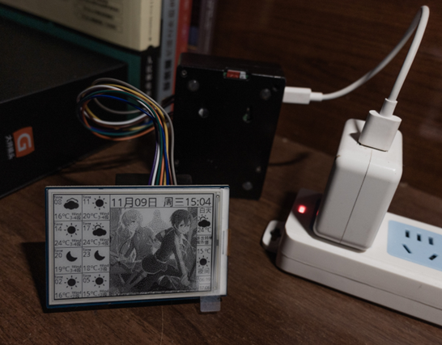
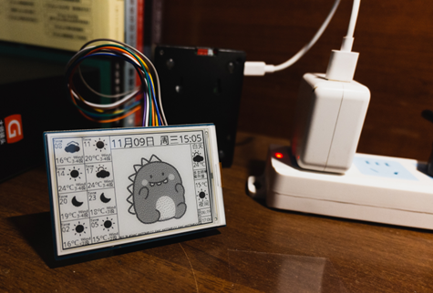
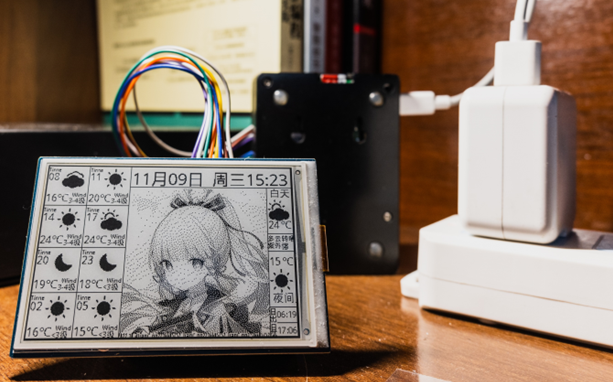

# weather_pi 树莓派天气预报与图片播报系统
#### 材料
树莓派3B、微雪电子3.52寸墨水屏
#### 素材库 
icons_bmp/
#### 图片库 
picture/      
> 图片库由于隐私原因暂未公开，名称格式：1.bmp 2.bmp ...
> 图片可以由picture2bmp程序得到，注意修改需要转化的图片目录
#### 微雪墨水屏驱动程序
epd3in52.py --未上传
#### 思路
使用request库获取到指定城市的天气网站，获取当天天气以及具体八个时间段、白天夜晚的天气与温度数据、日出日落时间

每隔一分钟刷新整个页面，用以随机更新图片

### 示例图片



### 使用
需要更改    
```python
def city_num(city="杭州"):
    dict_cty = {"杭州":"101210101"}
    return dict_cty[city]
```
为目标城市的代码